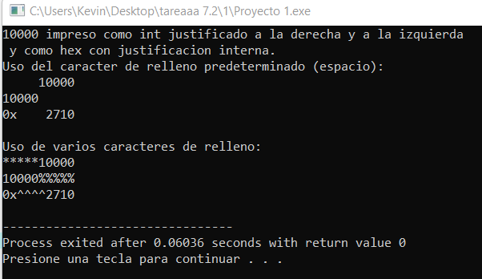
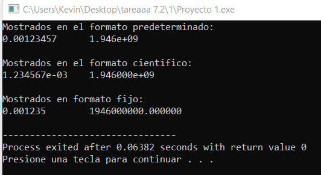

# C++ PDC_09

## :copyright: Autor
- :camera: 
- 
 :man: **Kevin Josue Rodriguez Henandez**
- :e-mail: Kevin31344@unitec.edu
- :link: [github.com/kevin09102001](https://github.com/kevin09102001)

---

## :black_circle: eof_get_y_put.cpp

---
## :triangular_ruler: salida

---
## :black_circle: cin_y_cin-get.cpp

---
## :triangular_ruler: salida

---

## :black_circle: cin-getline.cpp

---
## :triangular_ruler: salida

---
## :black_circle: read_y_write.cpp

---
## :triangular_ruler: salida

---
## :black_circle: dec_oct_hex_y_setbase.cpp

---
## :triangular_ruler: salida

---
## :black_circle: raiz.cpp

---
## :triangular_ruler: salida

---
## :black_circle: cout-width.cpp

---
## :triangular_ruler: salida

---
## :black_circle: cout-setw.cpp

---
## :triangular_ruler: salida

---
## :black_circle: cout-setw2.cpp

---
## :triangular_ruler: salida

---
## :black_circle: scientific_y_fixed.cpp

---
## :triangular_ruler: salida

---
## :black_circle: archivos_de_texto.cpp

---
## :triangular_ruler: salida

---
## :black_circle: Archivo_de_texto_leer.cpp

---
## :triangular_ruler: salida

---
## :black_circle: main.cpp

---
## :black_circle: contacto hpp

---
## :black_circle: contacto cpp

---

## :black_circle: acceso aleatorio cpp

---
## :black_circle: acceso aleatorio hpp

---
## :triangular_ruler: salida

## :computer: Repositorio

- :blue_book: [Ejemplo-de-static_cast-vs-dynamic_cast](https://github.com/nelbren/Ejemplo-de-static_cast-vs-dynamic_cast)
